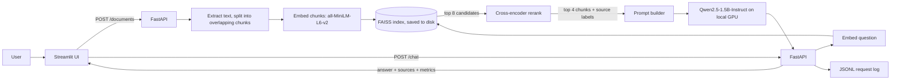

# Local GPU RAG Chat Assistant

**A private document Q&A assistant that runs entirely on a laptop GPU.** Upload a TXT, Markdown, or PDF file, ask questions about it, and get answers grounded in your documents, with the source chunks, rerank scores, and a full latency and token breakdown shown for every answer.

Built with FastAPI, Streamlit, FAISS, a cross-encoder reranker, and `Qwen2.5-1.5B-Instruct` running locally on an NVIDIA GeForce RTX 5060 Laptop GPU. No paid APIs, and no document data leaves the machine.

---

## Results at a glance

Evaluated on 30 questions across 4 documents, each asked with reranking on and off (details in [Evaluation](#evaluation)).

| Metric | Result |
|---|---|
| Correct answers to answerable questions | **25 / 25** |
| Correct "not found" replies to unanswerable questions | **4 / 5** |
| Answer chunk retrieved into the model's context | **25 / 25** |
| Average position of the answer chunk, without → with reranking | **1.80 → 1.48** |
| Extra latency added by reranking | **~46 ms** per question |
| Median end-to-end latency | **~4.2 s** |
| Peak GPU memory (LLM + embedder + reranker) | **3.2 GB** of 8 GB |

---

## Features

- **Two-stage retrieval.** FAISS vector search gathers candidates, and a cross-encoder reranks them so the best evidence comes first.
- **Grounded answers with citations.** Every answer shows which file and chunk it came from, with scores.
- **Hallucination guard.** The model is instructed to reply "I couldn't find that in the uploaded documents" when the context doesn't contain the answer.
- **Built-in observability.** Each request is logged with a request ID, per-stage latency, token counts, generation speed, peak VRAM, and success or error status.
- **Reranking toggle.** Switch reranking on or off in the UI or API to compare results directly.
- **Reproducible evaluation.** Answers use deterministic decoding, and one script runs the full test set and writes a results spreadsheet.

---

## Architecture



### How a question is answered

1. **Retrieve.** The question is embedded and FAISS returns the 8 most similar chunks.
2. **Rerank.** A cross-encoder scores each question–chunk pair together and keeps the best 4.
3. **Build the prompt.** The 4 chunks are labelled with their source file and placed in the prompt with strict grounding rules.
4. **Generate.** Qwen writes the answer on the GPU.
5. **Log.** Timings, token counts, sources, and status are written to `logs/requests.jsonl` and returned to the UI.

---

## Component choices

| Component | Choice | Why |
|---|---|---|
| Frontend | Streamlit | Interactive chat and upload UI in pure Python |
| Backend | FastAPI | Typed API with automatic docs at `/docs`; keeps inference separate from the UI |
| Embeddings | `sentence-transformers/all-MiniLM-L6-v2` | Small, fast, strong general-purpose semantic search |
| Vector index | FAISS `IndexFlatIP` on normalized vectors | Exact cosine-similarity search; fast at this scale with no database to run |
| Reranker | `cross-encoder/ms-marco-MiniLM-L-6-v2` | Reads question and chunk together for more precise relevance scores |
| LLM | `Qwen/Qwen2.5-1.5B-Instruct`, FP16 | Good instruction following for its size; fits in 8 GB VRAM alongside the other models |
| Chunking | 150 words with 30-word overlap | Fits within the embedding model's input limit (see below) |
| Decoding | Greedy, up to 512 new tokens | Same input always gives the same answer, which makes evaluation fair |

---

## Design decisions

**Chunk size is set by the embedding model's input limit.**
`all-MiniLM-L6-v2` only reads the first 256 word-pieces (roughly 190 words) of any text and silently ignores the rest. The first version of this project used 700-word chunks, so most of every chunk was invisible to search. Chunks are now 150 words (about 200 word-pieces), so the whole chunk is embedded. The 30-word overlap means an answer that falls on a chunk boundary still appears whole in at least one chunk.

**Retrieve broadly, then rerank precisely.**
Vector search compares precomputed embeddings, so it's fast, but it judges the question and each chunk separately. A cross-encoder reads them together, which is more accurate but slower. Reranking only the top 8 candidates gets that accuracy for about 46 ms.

**Deterministic answers.**
The first version sampled answers randomly (`do_sample=True`), so the same question could give different answers. Greedy decoding makes results repeatable, which the evaluation depends on.

**Separate timing for every stage.**
Retrieval, reranking, one-time model loading, and generation are timed separately. Without this, the first question's timings were dominated by model loading and gave a misleading picture.

**A small model on a laptop GPU.**
For grounded Q&A the model's job is to read and summarise the retrieved evidence, not to recall facts, so retrieval quality matters more than model size. A 1.5B model leaves plenty of VRAM headroom: the whole system peaks at 3.2 GB.

---

## Observability

Every chat request appends one JSON record to `logs/requests.jsonl`:

```json
{
  "request_id": "<uuid>",
  "timestamp": "<ISO 8601, UTC>",
  "question": "<text>",
  "use_rerank": true,
  "retrieval_ms": 27.0,
  "rerank_ms": 46.0,
  "model_load_ms": 0.0,
  "generation_ms": "<ms>",
  "prompt_tokens": "<int>",
  "completion_tokens": "<int>",
  "tokens_per_second": "<float>",
  "peak_vram_mb": "<float>",
  "hit_token_limit": false,
  "total_ms": "<ms>",
  "sources": ["project_brief.md#chunk3"],
  "status": "success"
}
```

Failed requests are logged too, with `"status": "error"` and the error message. The UI shows the key numbers under every answer, with the full record available in an expandable panel.

---

## Evaluation

### Test setup

The test set is designed so correct answers can only come from retrieval:

- **4 documents:** the project brief, a sample knowledge file, and two fictional documents written for this evaluation (a company employee handbook and an ML platform runbook). Because these are fictional, the model can't answer from general knowledge.
- **Deliberate distractors:** the handbook mentions an **RTX 4070** laptop GPU while the brief says **RTX 5060**, and the runbook also discusses request IDs and latency, to test whether retrieval picks the right document.
- **30 questions:** 25 answerable across the three main documents, plus 5 with no answer in any document.
- **Two runs:** every question is asked with reranking on and off, using the API's `use_rerank` flag.

Each result is scored automatically: whether the answer contains the expected keywords, whether the chunk containing the answer was retrieved, and what position that chunk was ranked.

### Results

| Metric | Rerank ON | Rerank OFF |
|---|---|---|
| Correct answers (answerable) | 25/25 (100%) | 25/25 (100%) |
| Correct refusals (unanswerable) | 4/5 (80%) | 4/5 (80%) |
| Answer chunk in retrieved context | 25/25 (100%) | 25/25 (100%) |
| Answer chunk ranked #1 | 17/25 (68%) | 16/25 (64%) |
| Average position of answer chunk | **1.48** | 1.80 |
| Top-ranked chunk from the correct document | 22/25 (88%) | 22/25 (88%) |
| Median total latency | 4.18 s | 4.53 s |
| Average retrieval time | 27 ms | 31 ms |
| Average rerank time | 46 ms | 0 ms |
| Peak VRAM | 3.23 GB | 3.22 GB |

Full per-question results are in [`eval/results.csv`](eval/results.csv) and the summary in [`eval/summary.md`](eval/summary.md).

### What the results show

1. **Reranking improves ordering.** It moved the answer chunk higher for 7 questions and lower for 3, improving the average position from 1.80 to 1.48. That includes the distractor question about the handbook's laptop GPU, where the correct chunk rose from position 4 to 2.
2. **At this corpus size, ordering didn't change accuracy.** The answer chunk was always somewhere in the top 4 chunks sent to the model, with or without reranking, so final answer accuracy was identical. Reranking's value should grow with more documents, where the right chunk is more likely to fall outside the top 4 without it.
3. **Reranking is cheap.** It adds about 46 ms, roughly 1% of a typical request. (The lower median latency with reranking on comes from differences in answer length, not from reranking itself.)
4. **One hallucination on a near-miss question.** Asked *"What version of Kubernetes does the Orbit platform run?"*, the model gave a vague invented answer instead of saying the information wasn't there. The runbook discusses Kubernetes clusters but never names a version, and questions that are *almost* answered by the context are a known weak spot for small models.

### Limitations of this evaluation

- It's a small corpus (4 documents), which is why retrieval recall was saturated.
- Keyword scoring is simple: it can miss correct answers worded differently, or pass a wrong answer that happens to contain the keyword. Answers flagged as incorrect were reviewed by hand.
- Each configuration was run once. Decoding is deterministic, but latency varies between runs.

### Run it yourself

With the backend running:

```powershell
.\.venv\Scripts\python.exe run_eval.py
```

The script clears the index, uploads the test documents, runs all 60 requests, and writes `eval/results.csv` and `eval/summary.md`.

---

## Performance note: generation speed

Inside the app, generation averages **about 4.5 tokens/second**. A standalone benchmark of the same model on the same GPU ([`speed_test.py`](speed_test.py)) reaches **33 tokens/second**, and its GPU compute and CUDA dispatch checks are both healthy. So the hardware and model aren't the bottleneck: something about how generation runs inside the server process slows it down about 7×.

Tested and ruled out so far: whether the backend window is in the foreground. Remaining hypotheses (longer RAG prompts, the embedder and reranker sharing the process, and FastAPI's worker thread) are covered by [`diagnose.py`](diagnose.py), which isolates each one. Fixing this is the top item on the roadmap.

---

## Getting started

### Requirements

- Windows with an NVIDIA GPU and a recent driver
- Python 3.11
- About 5 GB of free disk space for model downloads

### Install

```powershell
git clone https://github.com/beeps23/local-gpu-rag-chat.git
cd local-gpu-rag-chat
python -m venv .venv
.\.venv\Scripts\python.exe -m pip install torch --index-url https://download.pytorch.org/whl/cu128
.\.venv\Scripts\python.exe -m pip install -r requirements.txt
```

Check that PyTorch can see the GPU:

```powershell
.\.venv\Scripts\python.exe -c "import torch; print(torch.cuda.is_available(), torch.cuda.get_device_name(0))"
```

### Run

Start the backend in one terminal:

```powershell
.\.venv\Scripts\python.exe -m uvicorn backend.main:app --host 127.0.0.1 --port 8000
```

Start the frontend in a second terminal:

```powershell
.\.venv\Scripts\python.exe -m streamlit run frontend.py
```

Open http://localhost:8501. Interactive API docs are at http://127.0.0.1:8000/docs.

The models download from Hugging Face on first use. After that, setting `$env:HF_HUB_OFFLINE="1"` before starting the backend stops Hugging Face from checking online.

---

## API

| Method | Endpoint | Purpose |
|---|---|---|
| `GET` | `/health` | Service health check |
| `POST` | `/documents` | Upload and index a `.txt`, `.md`, or `.pdf` file |
| `DELETE` | `/documents` | Remove all indexed documents |
| `POST` | `/chat` | Ask a question |

**Ask a question** (PowerShell):

```powershell
Invoke-RestMethod -Method Post -Uri http://127.0.0.1:8000/chat `
  -ContentType "application/json" `
  -Body '{"question": "Why does this project use reranking?", "use_rerank": true}'
```

**Response:**

```json
{
  "request_id": "<uuid>",
  "answer": "<text>",
  "sources": [
    {
      "source": "project_brief.md",
      "chunk_id": 2,
      "text": "<chunk text>",
      "retrieval_rank": 1,
      "retrieval_score": 0.61,
      "rerank_score": 4.29
    }
  ],
  "metrics": { "...": "the full log record shown above" }
}
```

---

## Project structure

```
rag-chat-app/
├── backend/
│   ├── main.py            # FastAPI routes, request logging
│   ├── rag.py             # text extraction, chunking, FAISS search, reranking
│   └── llm.py             # model loading, prompt, generation, inference metrics
├── frontend.py            # Streamlit chat UI
├── run_eval.py            # evaluation: 30 questions × rerank on/off
├── speed_test.py          # standalone GPU and generation benchmark
├── diagnose.py            # isolates causes of the in-app generation slowdown
├── eval/
│   ├── docs/              # fictional test documents
│   ├── questions.csv
│   ├── results.csv
│   └── summary.md
├── project_brief.md
├── sample_knowledge.txt
└── requirements.txt
```

`data/` (the saved index and uploads) and `logs/` are created automatically when the app runs.

---

## Limitations

- In-app generation speed is about 7× slower than the standalone benchmark (see the performance note).
- The 1.5B model can hallucinate on questions the documents almost, but not quite, answer.
- Documents can only be cleared all at once, and re-uploading a file with the same name is rejected until the index is cleared.
- Single user, no authentication, and logs are stored in a local file.

## Roadmap

1. Find and fix the in-app generation slowdown.
2. Add a rerank-score threshold so weak matches return "not found" without calling the model.
3. Stream answers token by token and log time to first token.
4. Evaluate on a larger document set, where reranking should matter more.
5. Support deleting individual documents.
6. Compare a larger or quantized model against the current baseline.

---

## What I learned

<!-- Rewrite this in your own words before submitting. -->

The most important bugs weren't crashes. They were silent. My original 700-word chunks looked fine, but the embedding model was only reading the first 190 words of each one. Measuring things changed how I saw the project: reranking didn't change final accuracy on my test set, but it did move the right evidence higher, and the evaluation showed exactly where the model still hallucinates. Benchmarking the model on its own also showed that my app's slow generation wasn't a hardware limit, which turned a vague "it's slow" into a specific problem to solve.
